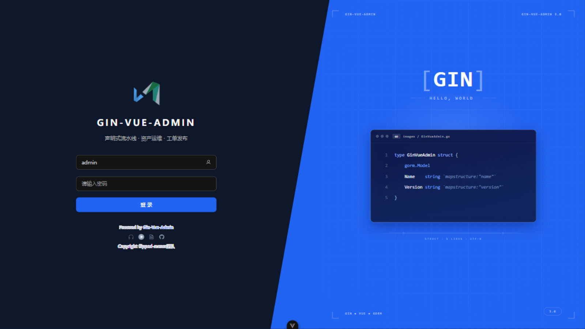
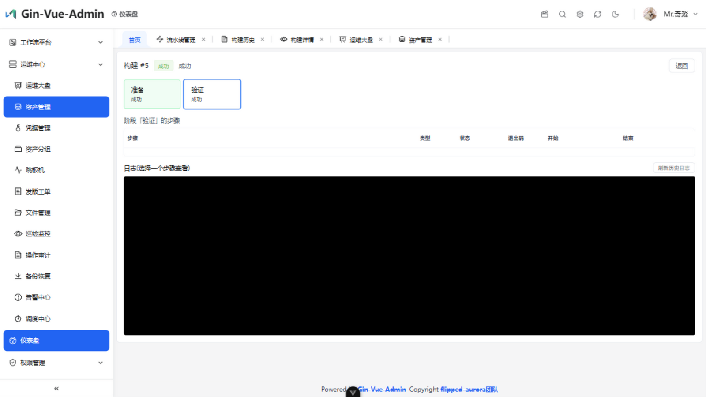
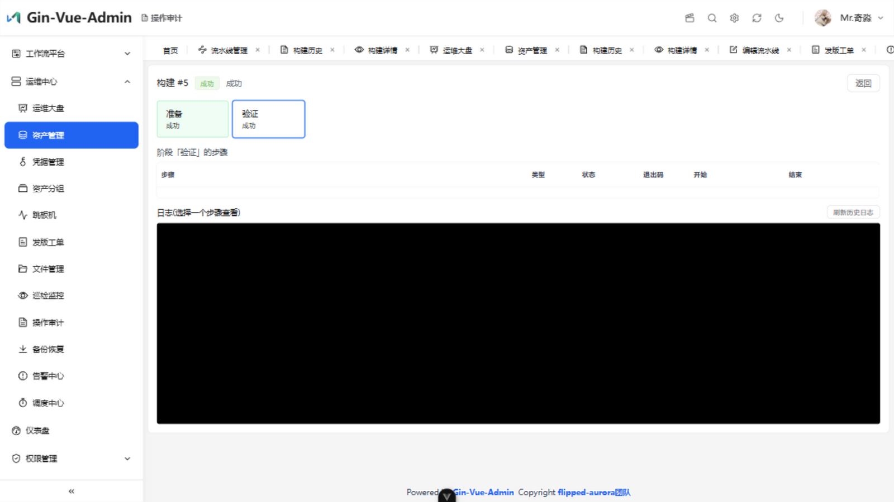
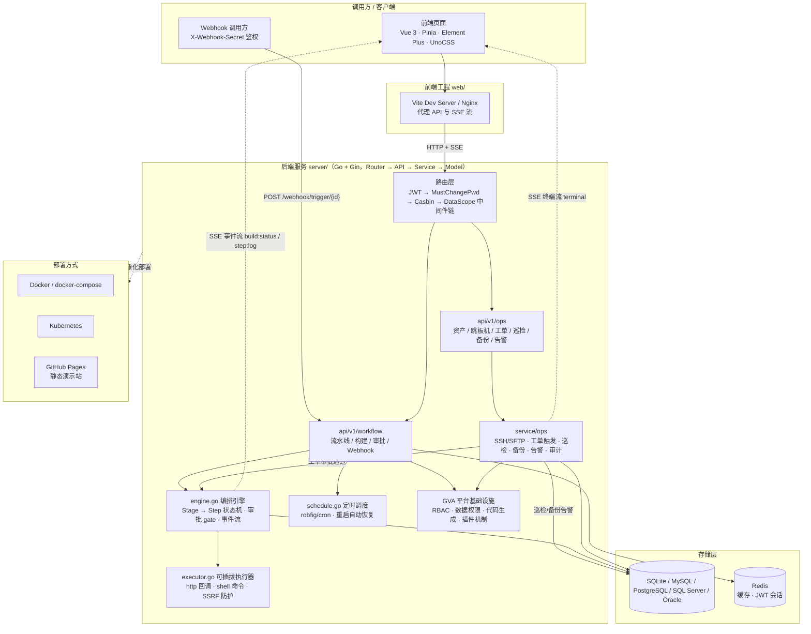

# New Jenkins：自研类 Jenkins 声明式流水线引擎 + 运维中心

[](https://github.com/hequan2017/new-jenkins/actions/workflows/ci.yaml)
[](https://github.com/hequan2017/new-jenkins/actions/workflows/pages.yaml)
[](LICENSE)
[](server/go.mod)
[](web/Dockerfile)
[](https://github.com/hequan2017/new-jenkins/issues)

仓库地址：[github.com/hequan2017/new-jenkins](https://github.com/hequan2017/new-jenkins)

New Jenkins 是基于 [gin-vue-admin](https://github.com/flipped-aurora/gin-vue-admin) 深度定制的全栈 DevOps 管理系统。项目保留 GVA 原有的 RBAC 权限、代码生成和插件化基础设施，并内置两大自研模块：

- **声明式流水线引擎**：类 Jenkins 的 `流水线 -> 阶段 -> 步骤` 编排，HTTP / Shell 步骤、人工审批、参数体系、SSE 实时日志、cron 与 Webhook 触发，不依赖外部 Jenkins 服务；
- **运维中心**：资产 / 分组 / 凭据管理、跳板机（命令执行 + Web 终端）、SFTP 文件管理、工单发版（审批后触发流水线）、巡检监控、备份恢复、告警中心、调度中心与操作审计。

> [!IMPORTANT]
> 本项目当前处于持续开发阶段。流水线执行器与 SSH 能力运行在服务进程所在主机，尚未提供远程 Agent、工作空间隔离或凭据保险库。请先阅读[安全边界与当前限制](#安全边界与当前限制)和[许可证](#许可证)，再评估部署方式。

## 界面预览

| 登录 | 首页大盘 |
| --- | --- |
|  |  |

### 工作流平台

| 流水线管理 | 流水线编辑器 |
| --- | --- |
|  |  |

| 构建历史 | 构建详情（阶段 / 步骤 / 日志） |
| --- | --- |
|  |  |

### 运维中心

| 运维大盘 | 资产管理 |
| --- | --- |
|  |  |

| 工单发版 | 告警中心 |
| --- | --- |
|  |  |

| 跳板机 | SFTP 文件管理 |
| --- | --- |
|  |  |

| 巡检监控 | 备份恢复 |
| --- | --- |
|  |  |

| 调度中心 | 操作审计 |
| --- | --- |
|  |  |

| 资产分组 | 凭据管理 |
| --- | --- |
|  |  |

## 目录

- [快速开始](#快速开始)
- [核心特性](#核心特性)
- [声明式定义示例](#声明式定义示例)
- [技术栈](#技术栈)
- [系统架构](#系统架构)
- [目录结构](#目录结构)
- [数据模型](#数据模型)
- [接口一览](#接口一览)
- [状态与执行语义](#状态与执行语义)
- [GitHub Pages 静态演示](#github-pages-静态演示)
- [安全边界与当前限制](#安全边界与当前限制)
- [配置说明](#配置说明)
- [开发验证](#开发验证)
- [部署](#部署)
- [路线图](#路线图)
- [参与贡献](#参与贡献)
- [问题反馈与安全报告](#问题反馈与安全报告)
- [许可证](#许可证)

## 快速开始

### 环境要求

| 依赖 | 版本 / 说明 |
| --- | --- |
| Git | 用于克隆和协作 |
| Go | 1.24；`server/go.mod` 声明 toolchain 1.24.2 |
| Node.js | 20；与前端 Dockerfile 和 CI 保持一致 |
| npm | 随 Node.js 安装，用于前端依赖与脚本 |
| 数据库 | 默认 SQLite，无需额外服务；也支持 MySQL、PostgreSQL、SQL Server、Oracle |
| Redis | 默认关闭；仅在启用相关缓存、会话能力时需要 |

### 获取代码

```bash
git clone https://github.com/hequan2017/new-jenkins.git
cd new-jenkins
```

### 启动后端

```bash
cd server
go mod download
go run .
```

后端默认监听 `http://127.0.0.1:8888`，默认使用 SQLite，数据库文件写入 `server/data/gva.db`。首次运行会按项目初始化流程创建表和基础数据。

如需指定其他配置文件：

```bash
go run . -c config.yaml
```

### 启动前端

另开一个终端：

```bash
cd web
npm install
npm run dev
```

前端开发服务默认访问 `http://127.0.0.1:8080`，`/api` 请求和 SSE 连接由 Vite 代理到后端 `8888` 端口。

### 默认账号

系统初始化完成后内置一个管理员账号，方便首次登录体验：

| 用户名 | 密码 | 角色 |
| --- | --- | --- |
| `admin` | `123456` | 超级管理员（authority 888） |

> [!WARNING]
> 默认密码仅用于本地开发与演示。任何对外可访问的部署（哪怕是内网测试环境）都必须先在「个人信息」中修改该密码，并在「系统设置 → 安全配置」中按需开启验证码、失败锁定与密码强度策略。

### 开始使用流水线

1. 登录系统并进入「工作流平台 → 流水线管理」。
2. 新建流水线，配置参数、Stage 和 HTTP/Shell Step。
3. 启用流水线后手动触发，或配置 cron/Webhook 触发。
4. 在「构建历史」查看 Stage 状态、Step 日志和审批操作。

## 核心特性

### 声明式流水线引擎

- **三层模型**：`流水线(Pipeline) -> 阶段(Stage) -> 步骤(Step)`，语义对齐 Jenkins 的 Job / Stage / Step
- **两种步骤类型**：
  - `http`：HTTP 回调，2xx 或指定状态码视为成功，内置 SSRF 防护（默认禁止内网/环回地址，可显式 `allowPrivate` 放行），响应体截断 64KB 写入日志
  - `shell`：进程内执行 Shell 命令，退出码 0 视为成功，支持超时控制与自定义环境变量，Windows 下自动回退 `sh` / `cmd`
- **编排能力**：
  - 阶段按序执行，步骤默认串行；阶段可开启 `Parallel` 实现步骤并行执行
  - 阶段可标记 `Approval`（人工审批 gate），跑完后构建进入 `running-approval` 等待人工批准/拒绝
  - 阶段可标记 `ContinueOnError`，步骤失败后继续执行后续阶段
- **参数体系**：流水线可声明 `ParamSchema`（string / number / bool），触发时按 Schema 校验必填与类型、回填默认值；执行器支持 `${param.xxx}` 与 `$param.xxx` 变量替换
- **定义与运行分离**：触发时在单事务内快照 Stage 的审批/容错/并行配置和 Step 的类型/配置；随后修改或删除定义都不改变本次构建

### 构建管理

- **状态机**：`pending -> running -> running-approval -> success | failed | canceled`
- 构建序号（buildNo）按流水线原子分配，并由 `(pipeline_id, build_no)` 唯一索引兜底；历史记录分页可查
- 支持**即时取消**（running / running-approval / pending）：运行上下文会同步取消，可中断 HTTP、Shell 和审批等待；支持复用历史参数**重跑**
- 构建详情按阶段/步骤展示运行视图，日志独立落表支持分页拉取

### 实时日志与告警

- **SSE 实时推送**：`build:status` / `stage:status` / `step:status` / `step:log` 事件流，构建过程实时刷新；断线重连后从数据库拉取补全
- **失败告警**：构建失败/取消时通过 SSE 定向推送给管理员角色（authority_id=888）用户
- 日志按 `stdout` / `stderr` / `system` 三种流分类，每条日志带时间戳与步骤内自增序号

### 触发方式

| 方式 | 说明 |
| --- | --- |
| 手动 | 页面触发，带参数收集表单 |
| 定时 | cron 表达式（支持 `@daily` 等描述符，可含秒位），基于 `robfig/cron` 注册；服务重启后自动从数据库恢复全部调度，启停联动 `enabled` 状态 |
| Webhook | 公开触发入口 `POST /webhook/trigger/{id}`，以 `X-Webhook-Secret` 头做密钥鉴权，请求体键值对自动映射为构建参数 |
| 工单 | 运维中心「工单发版」审批通过后自动触发绑定流水线，`trigger=ticket` 留审计痕迹 |

### 流水线管理

- 增删改查（级联保存 Stage/Step 树）、启用/停用、**克隆**（深拷贝定义树，克隆后默认手动触发避免重复定时）
- webhook 类型自动生成 32 字节随机密钥，更新时不覆盖已有密钥

### 运维中心

围绕「资产」的一站式运维能力，菜单位于系统顶部（工作流平台之后），包含 12 个页面：

| 模块 | 页面 | 能力 |
| --- | --- | --- |
| 资产管理 | 运维大盘 / 资产 / 分组 / 凭据 | 资产在线状态、分组（prod/staging/dev 环境维度）、SSH 凭据（密码/密钥，加密存储） |
| 跳板机 | 跳板机 / 文件管理 | 选资产执行命令、Web 终端（SSE 流式输出）、SFTP 目录浏览 / 上传 / 重命名 / 删除 |
| 发布流程 | 工单发版 | 申请（选流水线 + 入参）→ 审批 → 触发构建，状态回填与审批意见留痕 |
| 巡检备份 | 巡检监控 / 备份恢复 | 周期 SSH 执行检查命令、命中关键字生成告警；定期 SFTP 拉取远程文件归档本地、保留份数控制、支持下载恢复 |
| 告警与调度 | 告警中心 / 调度中心 | 巡检 / 工单 / 备份产生的告警统一处理（解决 / 忽略）；汇总流水线 cron、巡检、备份的统一调度视图 |
| 审计 | 操作审计 | 登录、命令执行、终端会话、文件操作、工单操作、巡检等操作全量落表，支持按动作 / 状态 / 关键字检索 |

运维中心与流水线引擎深度联动：工单审批通过即触发流水线构建，巡检异常与备份失败自动进入告警中心，所有页面共享资产管理的主机与凭据。

### 平台能力（继承自 GVA）

- RBAC 权限控制（Casbin）、行级数据权限（GORM 全局回调）
- 前后端插件机制，插件可独立打包分发
- 代码生成、表单设计器、Swagger 文档、统一响应结构

## 声明式定义示例

流水线由一个 JSON 定义描述，页面编辑器最终提交的结构与下面一致。`order` 决定顺序，`parallel` 控制阶段内步骤是否并发；参数只能引用 `paramSchema` 中已声明的名称。

```json
{
  "name": "release-service",
  "description": "构建、检查并发布服务",
  "triggerType": "manual",
  "enabled": true,
  "paramSchema": [
    { "name": "version", "label": "版本", "type": "string", "required": true, "default": "" },
    { "name": "dryRun", "label": "演练", "type": "bool", "required": false, "default": "false" }
  ],
  "stages": [
    {
      "name": "构建",
      "order": 1,
      "approval": false,
      "continueOnError": false,
      "parallel": true,
      "steps": [
        {
          "name": "编译",
          "type": "shell",
          "order": 1,
          "config": {
            "command": "go build -o app-${param.version} ./...",
            "timeoutSec": 600,
            "env": { "DRY_RUN": "$param.dryRun" }
          }
        },
        {
          "name": "健康检查",
          "type": "http",
          "order": 2,
          "config": {
            "url": "https://example.com/health?version=${param.version}",
            "method": "GET",
            "expectStatus": 200,
            "timeoutSec": 30,
            "allowPrivate": false
          }
        }
      ]
    },
    {
      "name": "发布审批",
      "order": 2,
      "approval": true,
      "continueOnError": false,
      "parallel": false,
      "steps": []
    },
    {
      "name": "发布",
      "order": 3,
      "approval": false,
      "continueOnError": false,
      "parallel": false,
      "steps": [
        {
          "name": "执行发布",
          "type": "shell",
          "order": 1,
          "config": { "command": "./deploy.sh ${param.version}", "timeoutSec": 900 }
        }
      ]
    }
  ]
}
```

步骤配置约定：

| 类型 | 必填字段 | 可选字段 | 成功条件 |
| --- | --- | --- | --- |
| `shell` | `command` | `timeoutSec`（默认 600）、`env` | 进程退出码为 0 |
| `http` | `url` | `method`（默认 GET）、`headers`、`body`、`timeoutSec`（默认 30）、`expectStatus`、`allowPrivate` | 默认 2xx；设置 `expectStatus` 时必须精确匹配 |

参数支持 `${param.name}` 和 `$param.name` 两种写法。替换仅发生在步骤配置的字符串值中，未声明参数、重复参数、未知参数或类型不匹配都会在触发阶段被拒绝。

## 技术栈

| 端 | 技术 |
| --- | --- |
| 前端 | Vue 3、Vite、Pinia、Element Plus、UnoCSS、Vue Router、Axios、ECharts、VueUse、SSE、xterm |
| 后端 | Go、Gin、GORM、Casbin、Viper、Zap、Redis、JWT、robfig/cron、golang.org/x/crypto/ssh |
| 存储 | 默认 SQLite（开箱即用），支持 MySQL / PostgreSQL / SQL Server / Oracle |
| 部署 | Docker、docker-compose、Kubernetes、GitHub Pages（静态演示） |

## 系统架构



## 目录结构

```
├── server/                     Go + Gin 后端
│   ├── api/v1/workflow/        流水线/构建/审批/Webhook API
│   ├── api/v1/ops/             运维中心 API（资产/跳板机/工单/巡检/备份/告警/审计）
│   ├── model/workflow/         流水线数据模型与 request/response 结构
│   ├── model/ops/              运维中心数据模型
│   ├── service/workflow/       Service 层（引擎 / 执行器 / 调度 / 构建 / 流水线）
│   │   ├── engine.go           编排核心：Stage→Step 状态机 + SSE + 审批 gate
│   │   ├── executor.go         可插拔执行器（http / shell）+ 变量替换 + SSRF 防护
│   │   ├── schedule.go         定时调度（robfig/cron，重启恢复）
│   │   ├── build.go            构建触发 / 取消 / 重跑 / 审批
│   │   └── pipeline.go         流水线定义 CRUD / 克隆 / 校验
│   ├── service/ops/            运维中心 Service（SSH/SFTP/工单触发/巡检/备份/告警/审计）
│   ├── router/workflow/        流水线路由注册（含公开 Webhook 路由）
│   ├── router/ops/             运维中心路由注册（含 SSE 终端流）
│   ├── initialize/             启动装配（含 LoadWorkflowSchedules 恢复调度）
│   └── ...                     GVA 既有基础设施
├── web/                        Vue 3 + Vite 前端
│   ├── src/view/workflow/      流水线列表/编辑、构建列表/详情页面
│   ├── src/view/ops/           运维中心 12 个页面
│   ├── src/api/workflow.js     流水线前端 API 封装
│   ├── src/api/ops.js          运维中心前端 API 封装
│   └── src/view/dashboard/     首页大盘（平台数据聚合）
├── deploy/                     部署资产（Docker、docker-compose、Kubernetes）
├── docs/screenshots/           README 界面截图
├── aiDoc/                      结构化 AI 协作文档层（规则、示例、记忆）
└── .github/                    CI / Pages 工作流、Issue 模板与社区配置
```

## 数据模型

### workflow 模块（`wf_` 前缀）

| 表 | 说明 |
| --- | --- |
| `wf_pipelines` | 流水线定义（名称、触发方式、cron、webhook 密钥、参数 Schema、启停） |
| `wf_pipeline_stages` | 阶段定义（顺序、是否审批、是否并行、是否容错继续） |
| `wf_pipeline_steps` | 步骤定义（类型、JSON 配置、顺序） |
| `wf_pipeline_builds` | 构建实例（状态机、唯一构建序号、入参、触发方式/人、时间） |
| `wf_pipeline_build_stages` | 构建阶段运行视图（名称/顺序/审批/容错/并行快照、状态、时间） |
| `wf_pipeline_build_steps` | 构建步骤运行视图（名称/类型/顺序/配置快照、退出码、时间） |
| `wf_pipeline_build_logs` | 日志行（build+step+seq 定位，流分类，分页/推流） |

### ops 模块（`ops_` 前缀）

| 表 | 说明 |
| --- | --- |
| `ops_assets` | 资产（主机地址、SSH 端口、系统、分组、标签、在线状态） |
| `ops_asset_groups` | 资产分组（prod / staging / dev 环境维度） |
| `ops_credentials` | SSH 凭据（密码 / 私钥，加密存储） |
| `ops_tickets` | 发版工单（绑定流水线 + 入参、申请人 / 审批人、状态机、构建回填） |
| `ops_inspect_tasks` / `ops_inspect_results` | 巡检任务与每次执行结果（命中关键字即异常） |
| `ops_backup_tasks` / `ops_backup_records` | 备份任务与归档记录（远程路径、保留份数、本地归档位置） |
| `ops_alerts` | 告警事件（来源 inspect / ticket / backup / manual，级别，处理状态） |
| `ops_audit_records` | 操作审计（操作人、动作、对象、来源 IP、结果、详情） |

## 接口一览

### 流水线管理（需登录）

| 方法 | 路径 | 说明 |
| --- | --- | --- |
| POST | `/workflow/createPipeline` | 创建流水线 |
| PUT | `/workflow/updatePipeline` | 更新流水线（全量覆盖 Stage/Step 树） |
| DELETE | `/workflow/deletePipeline` | 删除流水线（构建历史保留） |
| POST | `/workflow/togglePipeline` | 启用 / 停用 |
| POST | `/workflow/clonePipeline` | 克隆流水线 |
| POST | `/workflow/getPipelineList` | 流水线分页列表 |
| GET | `/workflow/findPipeline` | 流水线详情（含 Stage/Step 树） |

### 构建管理（需登录）

| 方法 | 路径 | 说明 |
| --- | --- | --- |
| POST | `/workflow/triggerBuild` | 触发构建（带参数） |
| POST | `/workflow/cancelBuild` | 取消构建 |
| POST | `/workflow/retryBuild` | 重跑历史构建 |
| POST | `/workflow/approveStage` | 审批 gate（批准 / 拒绝） |
| POST | `/workflow/getBuildList` | 构建历史分页列表 |
| GET | `/workflow/getBuildDetail` | 构建详情（阶段/步骤视图） |
| GET | `/workflow/getBuildLog` | 构建日志分页拉取 |
| GET | `/workflow/buildStream` | SSE 实时事件流 |

### 运维中心（需登录，均挂 `/ops` 前缀）

| 分组 | 代表接口 | 说明 |
| --- | --- | --- |
| 资产 | `getAssetList` / `createAsset` / `updateAsset` / `deleteAsset` | 资产 CRUD |
| 分组 | `getAssetGroupList` / `getAllAssetGroups` / `createAssetGroup` | 分组 CRUD |
| 凭据 | `getCredentialList` / `createCredential` / `testConnection` | 凭据 CRUD 与连通性测试 |
| 跳板机 | `execCommand` / `terminal`（SSE） | 命令执行与 Web 终端 |
| 文件 | `listDir` / `readFile` / `writeFile` / `mkdir` / `renameFile` / `removeFile` | SFTP 文件管理 |
| 工单 | `getTicketList` / `createTicket` / `approveTicket` / `cancelTicket` | 工单发版全流程 |
| 巡检 | `getInspectTaskList` / `createInspectTask` / `runInspectTask` / `getInspectResultList` | 巡检任务与结果 |
| 备份 | `getBackupTaskList` / `createBackupTask` / `runBackupTask` / `getBackupRecordList` / `downloadBackup` | 备份任务与归档下载 |
| 告警 | `getAlertList` / `handleAlert` | 告警查询与处理 |
| 调度 / 大盘 / 审计 | `getScheduleList` / `getDashboard` / `getAuditList` | 统一调度视图、大盘统计、审计检索 |

### Webhook（公开，免登录）

| 方法 | 路径 | 说明 |
| --- | --- | --- |
| POST | `/webhook/trigger/{id}` | 触发流水线，需 `X-Webhook-Secret` 头 |

请求体是参数 JSON 对象，例如：

```bash
curl -X POST "http://127.0.0.1:8888/webhook/trigger/1" \
  -H "Content-Type: application/json" \
  -H "X-Webhook-Secret: <secret>" \
  -d '{"version":"1.2.3","dryRun":false}'
```

## 状态与执行语义

```text
running ──步骤/阶段成功──> success
   │
   ├──审批阶段完成──> running-approval ──批准──> running
   │                                      └──拒绝──> failed
   ├──步骤失败且不容错────────────────────────────> failed
   └──取消（含 HTTP / Shell / 审批等待）──────────> canceled
```

- 串行阶段遇到失败会跳过该阶段剩余步骤；并行阶段等待所有已启动步骤收敛后再决定阶段结果。
- `continueOnError=true` 只允许继续后续阶段，失败步骤与阶段本身仍记录为 `failed`。
- 最后一个阶段设置 `approval=true` 不再等待后续批准，因为已经没有下一阶段。
- 构建状态和日志持久化到数据库；SSE 只负责实时增量，断线后页面通过详情与日志接口补齐。

## GitHub Pages 静态演示

仓库内置一键静态部署：`.github/workflows/pages.yaml` 在**推送到 `main`** 后自动执行测试（后端 `go vet` + workflow 单测、前端 `eslint`）、构建前端（hash 路由 + 相对资源路径）并发布到 GitHub Pages。

- 全程使用 Actions 内置的 `GITHUB_TOKEN`（OIDC），**不需要配置任何仓库 Secret**；
- 仓库需在 Settings → Pages 中把 Source 设为 **GitHub Actions**（一次性设置）；
- 发布地址形如 `https://<owner>.github.io/<repo>/`；
- Pages 站点只包含前端静态资源，**没有后端 API**：可预览登录页与整体界面结构，登录、流水线等需要后端的能力不可用。完整体验请按[快速开始](#快速开始)本地启动或参考[部署](#部署)。

也支持在 Actions 页面手动触发（workflow_dispatch）重新发布。

## 安全边界与当前限制

- Shell 命令等价于 Jenkins 的 `sh`：执行权限与服务进程相同，只应向可信流水线编辑者开放权限；本引擎不提供容器沙箱或命令白名单。
- HTTP 步骤默认拒绝环回、链路本地和私网地址；只有明确设置 `allowPrivate=true` 才放行内部目标。
- 运维中心的 SSH / SFTP 能力直接作用于目标资产：请仅录入受控资产、凭据落库加密存储但不等价于凭据保险库，务必限制运维中心相关菜单的角色授权。
- 当前执行器运行在 GVA 单进程本机，不包含远程 Agent、工作空间隔离、制品库或凭据保险库。
- SSE Hub 为进程内实现；多实例部署需要增加 Redis 等跨实例事件扇出，否则实时事件只到达承载该连接的实例。
- 进程重启会恢复 cron 注册，但不会自动接管重启前处于 `running` 或 `running-approval` 的构建。

## 配置说明

| 文件 | 用途 |
| --- | --- |
| `server/config.yaml` | 本地后端配置，包括端口、数据库、JWT、Redis、日志等 |
| `server/config.docker.yaml` | 容器环境后端配置示例 |
| `web/.env.development` | 前端开发环境变量 |
| `web/.env.production` | 前端生产构建环境变量 |

配置数据库、Webhook 或外部系统时，请遵循以下原则：

- 不要把真实密码、JWT 密钥、Webhook Secret、云访问密钥或其他生产凭据提交到 Git。
- 生产环境应通过 Secret 管理服务、容器 Secret 或受控环境变量注入敏感配置。
- Shell Step 继承后端进程的环境与权限；不要将不可信输入直接拼接到命令中。
- 开放 `allowPrivate` 前确认目标地址可信，并限制流水线编辑权限。

## 开发验证

提交 Pull Request 前，至少执行与变更范围对应的检查：

```bash
cd server
go test ./service/workflow
go vet ./...

cd ../web
npm run lint
npm run build
```

如果修改了后端公共模块，再补充运行 `go test ./...`。当前仓库的全量测试可能包含与 workflow 模块无关的既有基线问题，发现失败时请在 Pull Request 中记录具体包、用例和错误信息，不要忽略或笼统标记为通过。

常用构建命令：

```bash
# 本地构建前后端，产物写入 build/
make build-local

# 生成 Swagger 文档
make doc

# 构建前端、后端或完整镜像
make build-image-web
make build-image-server
make image
```

## 部署

仓库提供以下部署资产：

| 方式 | 入口 | 适用场景 |
| --- | --- | --- |
| Docker Compose | `deploy/docker-compose/docker-compose.yaml` | 本地联调、功能验证和单机部署样例 |
| Kubernetes | `deploy/kubernetes/` | 集群部署基础清单，使用前需结合实际环境调整 |
| 独立镜像 | `server/Dockerfile`、`web/Dockerfile` | 分别构建后端与前端镜像 |
| 一体化镜像 | `deploy/docker/Dockerfile` | 构建包含前后端产物的镜像 |
| GitHub Pages | `.github/workflows/pages.yaml` | 前端静态演示站，推送 main 自动发布 |

> [!WARNING]
> Docker Compose 文件包含仅用于示例环境的数据库账号和明文口令。部署前必须替换所有示例凭据，限制数据库与 Redis 的网络暴露，并根据实际环境配置持久化、TLS、备份、资源限额和健康检查。现有清单不代表生产安全基线。

由于 SSE Hub 当前为进程内实现，直接扩展为多个后端副本会造成实时事件分散。在完成跨实例事件总线之前，建议后端保持单实例，或为同一构建连接配置可靠的会话粘滞策略。

## 路线图

以下方向尚未完成，欢迎通过 Issue 参与设计讨论：

- 远程 Agent 与异构执行节点调度。
- 构建工作空间、制品和缓存隔离。
- 凭据保险库及步骤级安全注入。
- 基于 Redis 等事件总线的多实例 SSE 扇出。
- 服务重启后对运行中、审批中构建的恢复与接管。
- 更丰富的声明式步骤、条件表达式和可复用模板。
- 运维中心：批量命令执行、资产探活自动发现、告警通知渠道（邮件 / 钉钉 / 飞书）。

路线图不构成版本或交付时间承诺，实际优先级以仓库 Issue 和维护计划为准。

## 参与贡献

欢迎提交 Bug 修复、文档改进、测试和独立设计的新能力。建议采用以下流程：

1. 对大型功能、接口变更或架构调整，先创建 [Issue](https://github.com/hequan2017/new-jenkins/issues) 讨论目标与边界。
2. Fork 仓库，并从最新的 `main` 创建功能分支。
3. 保持改动聚焦，补充必要测试和文档，执行[开发验证](#开发验证)。
4. 使用清晰的提交信息，推荐格式：`type(scope): description`。
5. 向 `main` 提交 Pull Request，说明背景、实现、验证结果及兼容性影响。

参与贡献即表示你同意提交内容遵循本仓库的许可证和归属要求。请勿提交无法合法再分发的代码、资源、凭据或个人数据。

## 问题反馈与安全报告

- Bug：使用 [Bug Report](https://github.com/hequan2017/new-jenkins/issues/new?template=bug_report.yaml) 提供版本、复现步骤、预期行为和必要日志。
- 功能建议：使用 [Feature Request](https://github.com/hequan2017/new-jenkins/issues/new?template=feature_request.yaml) 描述使用场景与期望结果。
- 一般讨论：进入仓库 [Issues](https://github.com/hequan2017/new-jenkins/issues) 检索或创建议题。
- 安全问题：不要在公开 Issue 中披露可利用细节、真实密钥或生产数据；请通过 GitHub 仓库所有者提供的私密联系方式报告，并在修复公开前保留合理处置时间。

## 相关文档

- [GitHub 开源仓库](https://github.com/hequan2017/new-jenkins)：源代码、版本历史与协作入口。
- [Issues](https://github.com/hequan2017/new-jenkins/issues)：问题反馈与功能建议。
- `server/docs/`：后端 Swagger 生成文件。
- `aiDoc/`：项目架构、开发流程、分层规则、示例和 AI 协作文档。
- `AGENTS.md`：本仓库的 AI 协作规则。

## 许可证

本仓库所含许可作品采用 [Business Source License 1.1](LICENSE) 授权。许可证允许满足条款的个人使用、评估与开发使用，以及非商业教学、研究或学术用途；任何未被附加授权明确允许的使用均属于 Production Use，需要取得有效商业许可证。

每个版本在首次公开发布三年后到达 Change Date，并针对该版本转为 Apache License 2.0。具体定义、使用条件、授权验证机制、免责声明、商业授权联系方式及版本转换规则均以仓库中的 [LICENSE](LICENSE) 原文为准。

本项目基于 [gin-vue-admin](https://github.com/flipped-aurora/gin-vue-admin) 进行定制开发，保留其原始项目归属、许可声明和品牌权利。本许可证不授予许可方商标、服务标记、商号或 Logo 的使用权。
