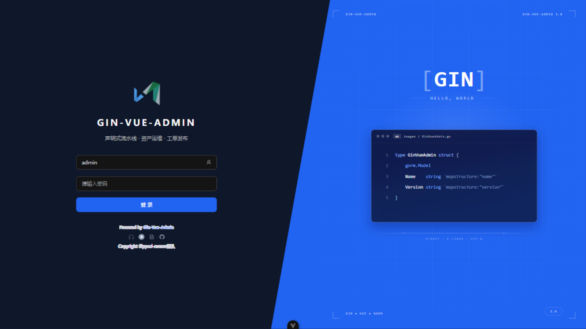
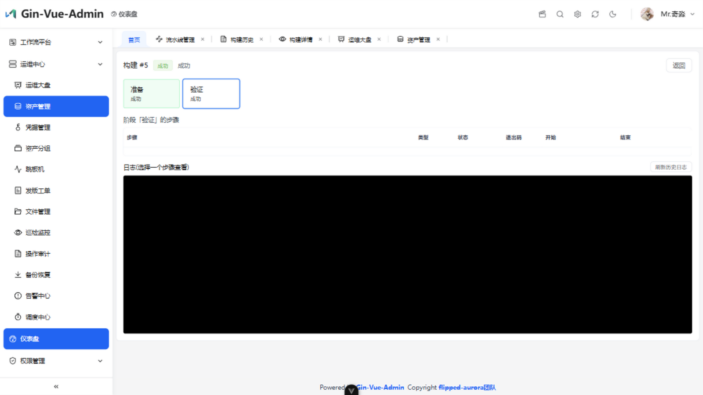
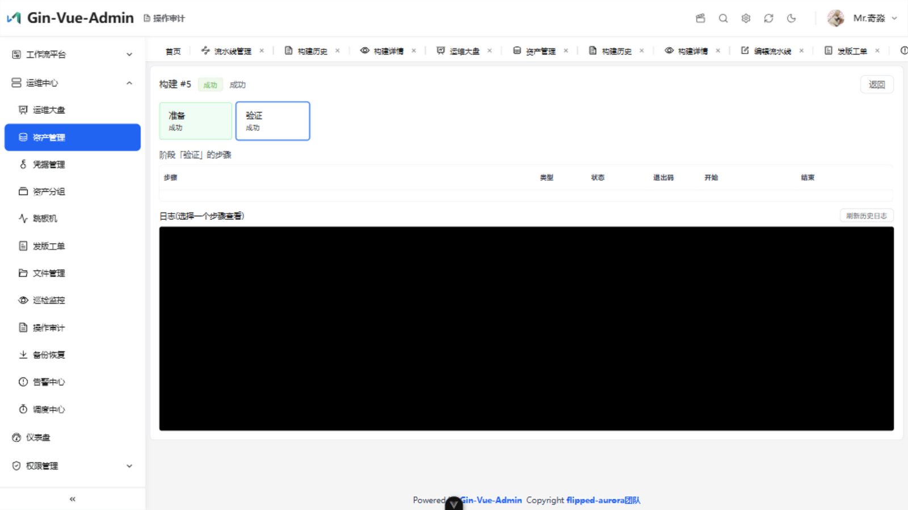

[简体中文](README.md) | [English](README.en.md)

# New Jenkins

基于 [gin-vue-admin](https://github.com/flipped-aurora/gin-vue-admin) 深度定制的全栈 DevOps 管理系统：自研类 Jenkins 声明式流水线引擎 + 一站式运维中心。

[](https://github.com/hequan2017/new-jenkins/actions/workflows/ci.yaml)
[](https://github.com/hequan2017/new-jenkins/actions/workflows/pages.yaml)
[](LICENSE)
[](server/go.mod)
[](web/Dockerfile)
[](https://github.com/hequan2017/new-jenkins/issues)

> [!IMPORTANT]
> 本项目当前处于持续开发阶段。流水线执行器与 SSH 能力运行在服务进程所在主机，尚未提供远程 Agent、工作空间隔离或凭据保险库。部署前请先阅读[安全边界与当前限制](#%EF%B8%8F-安全边界与当前限制)和 [License](#-license)。

## 项目介绍

New Jenkins 在保留 GVA（gin-vue-admin）原有 RBAC 权限、代码生成和插件化基础设施的同时，内置两大自研模块：

- **声明式流水线引擎**：类 Jenkins 的 `流水线 -> 阶段 -> 步骤` 编排，支持 HTTP / Shell 步骤、人工审批、参数体系、SSE 实时日志、cron 与 Webhook 触发，不依赖外部 Jenkins 服务；
- **运维中心**：资产 / 分组 / 凭据管理、跳板机（命令执行 + Web 终端）、SFTP 文件管理、工单发版（审批后自动触发流水线）、巡检监控、备份恢复、告警中心、调度中心与操作审计。

适合谁：需要轻量级 CI/CD + 主机运维能力一体化平台、又不想维护独立 Jenkins 集群的中小团队和个人运维/开发者。

## ✨ 功能特性

### 声明式流水线引擎

- **三层模型**：`流水线(Pipeline) -> 阶段(Stage) -> 步骤(Step)`，语义对齐 Jenkins 的 Job / Stage / Step
- **两种步骤类型**：
  - `http`：HTTP 回调，2xx 或指定状态码视为成功，内置 SSRF 防护（默认禁止内网/环回地址，可显式 `allowPrivate` 放行）
  - `shell`：进程内执行 Shell 命令，退出码 0 视为成功，支持超时控制与自定义环境变量
- **编排能力**：阶段按序执行；阶段可开启 `Parallel` 并行步骤、标记 `Approval`（人工审批 gate）、`ContinueOnError`（失败后继续后续阶段）
- **参数体系**：`ParamSchema`（string / number / bool）声明参数，触发时校验必填与类型，支持 `${param.xxx}` / `$param.xxx` 变量替换
- **定义与运行分离**：触发时快照 Stage/Step 配置，事后修改或删除定义不影响进行中的构建

### 构建管理与实时日志

- 状态机 `pending -> running -> running-approval -> success | failed | canceled`，构建序号原子分配
- 支持**即时取消**（可中断 HTTP / Shell / 审批等待）与复用历史参数**重跑**
- **SSE 实时推送** `build:status` / `stage:status` / `step:status` / `step:log` 事件流，断线重连后自动补全；构建失败/取消定向告警管理员
- 日志按 `stdout` / `stderr` / `system` 分类落库，支持分页拉取

### 触发方式

| 方式 | 说明 |
| --- | --- |
| 手动 | 页面触发，带参数收集表单 |
| 定时 | cron 表达式（支持 `@daily` 等描述符），服务重启后自动从数据库恢复调度 |
| Webhook | 公开入口 `POST /webhook/trigger/{id}`，`X-Webhook-Secret` 头鉴权，请求体自动映射为构建参数 |
| 工单 | 运维中心「工单发版」审批通过后自动触发绑定流水线 |

Webhook 触发示例：

```bash
curl -X POST "http://127.0.0.1:8888/webhook/trigger/1" \
  -H "Content-Type: application/json" \
  -H "X-Webhook-Secret: <secret>" \
  -d '{"version":"1.2.3","dryRun":false}'
```

### 运维中心（12 个页面）

| 模块 | 能力 |
| --- | --- |
| 资产管理 | 资产在线状态、分组（prod/staging/dev）、SSH 凭据（密码/密钥，加密存储） |
| 跳板机 | 选资产执行命令、Web 终端（SSE 流式输出）、SFTP 目录浏览 / 上传 / 重命名 / 删除 |
| 工单发版 | 申请 → 审批 → 自动触发流水线构建，状态回填与审批意见留痕 |
| 巡检监控 | 周期 SSH 执行检查命令，命中关键字自动生成告警 |
| 备份恢复 | 定期 SFTP 拉取远程文件归档本地，保留份数控制、下载恢复 |
| 告警中心 | 巡检 / 工单 / 备份产生的告警统一处理（解决 / 忽略） |
| 调度中心 | 汇总流水线 cron、巡检、备份的统一调度视图 |
| 操作审计 | 登录、命令执行、终端会话、文件操作、工单、巡检全量落表，支持多维度检索 |

### 平台能力（继承自 GVA）

- RBAC 权限控制（Casbin）、行级数据权限、前后端插件机制、代码生成、表单设计器、Swagger 文档

## 🛠 技术栈

| 端 | 技术 |
| --- | --- |
| 前端 | Vue 3、Vite、Pinia、Element Plus、UnoCSS、ECharts、xterm（Node.js 20） |
| 后端 | Go 1.24、Gin、GORM、Casbin、Viper、Zap、JWT、robfig/cron、golang.org/x/crypto/ssh |
| 存储 | 默认 SQLite（开箱即用），支持 MySQL / PostgreSQL / SQL Server / Oracle；Redis 可选 |
| 部署 | Docker、docker-compose、Kubernetes、GitHub Pages（前端静态演示） |

## 🚀 快速开始

环境要求：Go 1.24、Node.js 20、npm；数据库默认 SQLite，无需额外服务。

```bash
git clone https://github.com/hequan2017/new-jenkins.git
cd new-jenkins

# 启动后端（默认监听 http://127.0.0.1:8888，SQLite 写入 server/data/gva.db）
cd server
go mod download
go run .

# 另开终端启动前端（http://127.0.0.1:8080，/api 与 SSE 由 Vite 代理到 8888）
cd web
npm install
npm run dev
```

默认管理员账号：`admin` / `123456`（authority 888）。任何对外可访问的部署请先修改默认密码，并在「系统设置 → 安全配置」中开启验证码、失败锁定与密码强度策略。

开始使用流水线：登录 → 「工作流平台 → 流水线管理」→ 新建流水线并配置参数、Stage 与 HTTP/Shell Step → 手动触发或配置 cron / Webhook → 在「构建历史」查看阶段状态、步骤日志与审批操作。

常用构建命令：

```bash
make build-local        # 本地构建前后端，产物写入 build/
make doc                # 生成 Swagger 文档
make image              # 构建前后端一体镜像
cd server && go test ./service/workflow && go vet ./...   # 后端验证
cd web && npm run lint && npm run build                   # 前端验证
```

主要配置文件：`server/config.yaml`（本地后端配置）、`server/config.docker.yaml`（容器环境示例）、`web/.env.development` / `web/.env.production`（前端环境变量）。不要把真实密码、JWT 密钥、Webhook Secret 提交到 Git，生产环境应通过 Secret 管理服务注入。

部署资产：`deploy/docker-compose/docker-compose.yaml`（单机部署样例）、`deploy/kubernetes/`（集群清单）、`server/Dockerfile` 与 `web/Dockerfile`（独立镜像）、`deploy/docker/Dockerfile`（一体化镜像）、`.github/workflows/pages.yaml`（推送 main 自动发布前端静态演示到 GitHub Pages，无需配置仓库 Secret；Pages 站点没有后端 API，仅可预览界面结构）。Compose 文件包含示例明文口令，部署前必须替换。

## 📁 目录结构

```
├── server/                  Go + Gin 后端
│   ├── api/v1/workflow/     流水线/构建/审批/Webhook API
│   ├── api/v1/ops/          运维中心 API
│   ├── service/workflow/    编排引擎(engine.go)/执行器(executor.go)/调度(schedule.go)
│   ├── service/ops/         SSH/SFTP/工单/巡检/备份/告警/审计
│   └── model/               workflow(wf_ 前缀) 与 ops(ops_ 前缀) 数据模型
├── web/                     Vue 3 + Vite 前端
│   └── src/view/            workflow/ 与 ops/（12 个运维页面）
├── deploy/                  Docker、docker-compose、Kubernetes 部署资产
├── docs/screenshots/        界面截图
└── .github/                 CI / Pages 工作流与社区配置
```

## 📸 截图预览

| 登录 | 首页大盘 |
| --- | --- |
|  |  |

**工作流平台**

| 流水线管理 | 流水线编辑器 |
| --- | --- |
|  |  |

| 构建历史 | 构建详情（阶段 / 步骤 / 日志） |
| --- | --- |
|  |  |

**运维中心**

| 运维大盘 | 资产管理 |
| --- | --- |
|  |  |

| 工单发版 | 告警中心 |
| --- | --- |
|  |  |

| 跳板机 | SFTP 文件管理 |
| --- | --- |
|  |  |

| 巡检监控 | 备份恢复 |
| --- | --- |
|  |  |

| 调度中心 | 操作审计 |
| --- | --- |
|  |  |

| 资产分组 | 凭据管理 |
| --- | --- |
|  |  |

## ⚠️ 安全边界与当前限制

- Shell 命令执行权限与服务进程相同，本引擎不提供容器沙箱或命令白名单，只应向可信流水线编辑者开放权限。
- HTTP 步骤默认拒绝环回、链路本地和私网地址，仅显式 `allowPrivate=true` 放行内部目标。
- SSH / SFTP 能力直接作用于目标资产；凭据落库加密存储但不等价于凭据保险库，务必限制运维中心菜单的角色授权。
- 执行器运行在 GVA 单进程本机：无远程 Agent、工作空间隔离、制品库；SSE Hub 为进程内实现，多实例部署会导致实时事件分散，建议后端保持单实例。
- 进程重启会恢复 cron 注册，但不会自动接管重启前处于 `running` / `running-approval` 的构建。

路线图（欢迎通过 Issue 参与讨论）：远程 Agent 与异构执行节点、工作空间/制品隔离、凭据保险库、跨实例 SSE 事件总线、中断构建恢复、告警通知渠道（邮件 / 钉钉 / 飞书）等。

## 🔗 相关项目

- [gin-vue-admin](https://github.com/flipped-aurora/gin-vue-admin)：本项目基于其深度定制，保留原始项目归属与许可声明。
- [Issues](https://github.com/hequan2017/new-jenkins/issues)：问题反馈与功能建议；Bug 使用 [Bug Report](https://github.com/hequan2017/new-jenkins/issues/new?template=bug_report.yaml) 模板，功能建议使用 [Feature Request](https://github.com/hequan2017/new-jenkins/issues/new?template=feature_request.yaml) 模板。安全问题请勿在公开 Issue 披露细节，请通过仓库所有者私密联系方式报告。
- `server/docs/`：后端 Swagger 生成文件；`aiDoc/` 与 `AGENTS.md`：AI 协作规则与文档。

欢迎参与贡献：大变更请先创建 Issue 讨论，Fork 后从最新 `main` 拉功能分支，保持改动聚焦并补充测试与文档，提交信息推荐 `type(scope): description` 格式。

## 📄 License

本仓库所含许可作品采用 [Business Source License 1.1](LICENSE) 授权：允许满足条款的个人使用、评估与开发使用，以及非商业教学、研究或学术用途；未被明确允许的使用均属于 Production Use，需要取得有效商业许可证。每个版本在首次公开发布三年后到达 Change Date，转为 Apache License 2.0。具体条款以 [LICENSE](LICENSE) 原文为准。

本项目基于 gin-vue-admin 定制开发，保留其原始项目归属、许可声明和品牌权利；本许可证不授予其商标、服务标记、商号或 Logo 的使用权。
